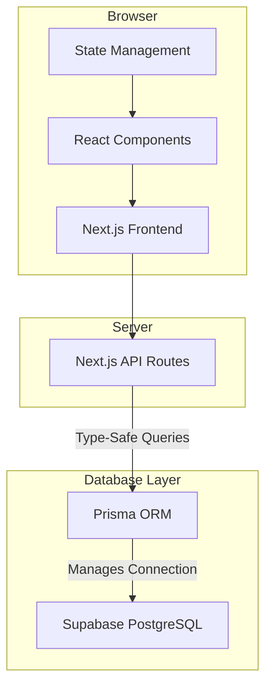

# 🛡️ SecureSight CCTV Dashboard

<div align="center">

**A modern, full-stack CCTV monitoring dashboard featuring real-time incident tracking, an interactive 24-hour timeline, and optimistic UI updates. Built with Next.js 15, Prisma, and Supabase.**

[](https://nextjs.org/)
[](https://www.typescriptlang.org/)
[](https://www.prisma.io/)
[](https://tailwindcss.com/)


[🚀 Live Demo](https://secure-sight-pi.vercel.app/) • [📖 Documentation](#-features) 

</div>

---

## ✨ About The Project

SecureSight is a comprehensive solution for modern security monitoring. Traditional CCTV systems often have clunky, slow interfaces. This project re-imagines the experience with a fluid, real-time dashboard that allows security operators to track, review, and resolve incidents with maximum efficiency.

Key design principles include:
* **⚡ Real-time First:** Data synchronization and live updates are core to the experience.
* **Intuitive UX:** A highly interactive timeline and integrated player make incident review seamless.
* **Optimistic UI:** Actions feel instantaneous, providing immediate feedback to the user while data synchronizes in the background.
* **Type-Safe & Robust:** Leveraging TypeScript and Prisma from front to back ensures code quality and maintainability.

---

## 📚 Table of Contents
* [🌟 Features](#-features)
* [🛠️ Tech Stack](#️-tech-stack)
* [🏗️ Architecture](#️-architecture)
* [🚀 Getting Started](#-getting-started)
* [🌐 Deployment](#-deployment)
* [🔧 API Reference](#-api-reference)
* [🗄️ Database Schema](#️-database-schema)
* [🗺️ Roadmap](#️-roadmap)
* [🤝 Contributing](#-contributing)
* [📄 License](#-license)

---

## 🌟 Features

### **🎯 Core Functionality**
* **🔴 Real-time Incident Monitoring:** Live dashboard for tracking and resolving incidents.
* **⏱️ Interactive Timeline:** A 24-hour incident timeline with zoom, pan, and playback controls.
* **🎬 Incident Player:** Integrated video player interface with detailed incident metadata.
* **📹 Camera Management:** View and monitor multiple camera feeds and their status.
* **✅ Incident Resolution:** Mark incidents as resolved with optimistic UI updates for an instant response.

### **📈 Advanced UX**
* **🔄 Bidirectional Sync:** Selecting an incident on the timeline highlights it in the list, and vice-versa.
* **🎯 Auto-focus:** The timeline automatically centers on the selected incident.
* **📅 Date Navigation:** Easily browse through historical data day by day.
* **🔍 Granular Zoom Controls:** Multiple zoom levels (24h, 12h, 6h, 3h, 1h, 30m) for detailed inspection.
* **▶️ Playback Controls:** Play, pause, adjust speed, and scrub through the timeline.

### **🔧 Technical Highlights**
* **🛡️ Type-Safe Operations:** End-to-end type safety with Prisma and TypeScript.
* **⚠️ Severity Classification:** Incidents are categorized by **Critical, High, Medium,** and **Low** priority.
* **🌙 Comprehensive Dark Theme:** Full dark/light theme system with automatic system preference detection.

---

## 🛠️ Tech Stack

| Category      | Technology                                                                                           | Purpose                               |
|---------------|------------------------------------------------------------------------------------------------------|---------------------------------------|
| **Framework** | [Next.js](https://nextjs.org/) 15                                                                    | React framework for full-stack apps   |
| **Language** | [TypeScript](https://www.typescriptlang.org/) 5.0                                                    | Type-safe JavaScript                  |
| **Database** | [Supabase](https://supabase.com/) (PostgreSQL)                                                       | Managed database hosting & services   |
| **ORM** | [Prisma](https://www.prisma.io/) 5.7                                                                 | Type-safe database client             |
| **Styling** | [Tailwind CSS](https://tailwindcss.com/)                                                             | Utility-first CSS framework           |
| **Components** | [shadcn/ui](https://ui.shadcn.com/)                                                                  | Accessible, unstyled UI components    |
| **Theming** | [next-themes](https://github.com/pacocoursey/next-themes)                                            | Theme management for Next.js          |

---

## 🏗️ Architecture

The application is built on a modern, full-stack architecture using Next.js API Routes as the backend, with all database interactions handled safely through Prisma.



---

## 🚀 Getting Started

Follow these instructions to get a local copy up and running.

### **Prerequisites**
* Node.js v18.0 or newer
* A Supabase account and an active project
* Git

### **Installation**
1.  **Clone the repository:**
    ```bash
    git clone [https://github.com/yourusername/securesight-dashboard.git](https://github.com/yourusername/securesight-dashboard.git)
    cd securesight-dashboard
    ```
2.  **Install dependencies:**
    ```bash
    npm install
    ```
3.  **Set up environment variables:**
    * Copy the example environment file.
        ```bash
        cp .env.example .env.local
        ```
    * Edit `.env.local` and add your Supabase `DATABASE_URL` and `DIRECT_URL` from your project's dashboard.
4.  **Set up the database:**
    ```bash
    # Generate the Prisma client based on your schema
    npx prisma generate

    # Push the schema to your Supabase database
    npx prisma db push

    # Seed the database with sample data
    npx prisma db seed
    ```
5.  **Run the development server:**
    ```bash
    npm run dev
    ```
Open [http://localhost:3000](http://localhost:3000) to view the dashboard.

---

## 🌐 Deployment

This project is optimized for deployment on Vercel.

### **Deploy with Vercel**
The easiest way to deploy is using the Vercel platform.
[](https://vercel.com/new/clone?repository-url=https://github.com/yourusername/securesight-dashboard)

After deploying, remember to add your `DATABASE_URL` and `DIRECT_URL` as environment variables in the Vercel project settings.

---

## 🔧 API Reference

#### Incident Endpoints
* `GET /api/incidents`: Fetches incidents.
    * Query Param: `resolved=true|false` to filter by status.
* `PATCH /api/incidents/[id]/resolve`: Toggles the resolution status of an incident.

#### Camera Endpoints
* `GET /api/cameras`: Fetches all cameras with their incident count.

---

## 🗄️ Database Schema

```prisma
// file: prisma/schema.prisma

model Camera {
  id           Int          @id @default(autoincrement())
  name         String
  location     String
  status       CameraStatus @default(ONLINE)
  thumbnailUrl String
  incidents    Incident[]
  createdAt    DateTime     @default(now())
  updatedAt    DateTime     @updatedAt
}

model Incident {
  id           Int          @id @default(autoincrement())
  cameraId     Int
  type         IncidentType
  tsStart      DateTime
  tsEnd        DateTime
  thumbnailUrl String
  resolved     Boolean      @default(false)
  severity     Severity     @default(MEDIUM)
  description  String?
  camera       Camera       @relation(fields: [cameraId], references: [id])
  createdAt    DateTime     @default(now())
  updatedAt    DateTime     @updatedAt
}

enum CameraStatus {
  ONLINE
  OFFLINE
  MAINTENANCE
}

enum IncidentType {
  GUN_THREAT
  UNAUTHORISED_ACCESS
  FACE_RECOGNISED
  SUSPICIOUS_ACTIVITY
  MOTION_DETECTION
  EQUIPMENT_TAMPERING
}

enum Severity {
  LOW
  MEDIUM
  HIGH
  CRITICAL
}
```

---

## 🗺️ Roadmap

This project has a solid foundation. Here are some features planned for the future:

* [ ] **Authentication:** Implement NextAuth.js with role-based access for operators and admins.
* [ ] **Real-time Updates:** Integrate WebSockets (e.g., via Supabase Realtime) for live incident feeds without manual refreshing.
* [ ] **Advanced Analytics:** A dedicated analytics page with charts for incident trends and camera uptime.
* [ ] **PWA Support:** Add a service worker and manifest file for offline capabilities and a native-like mobile experience.
* [ ] **Notifications:** Implement email or push notifications for critical incidents.
* [ ] **Comprehensive Testing:** Add end-to-end tests with Playwright and unit tests with Jest/RTL.
* [ ] **Performance Caching:** Implement Redis for caching expensive API queries.

---

## 🤝 Contributing

Contributions are welcome! If you have a suggestion or want to fix a bug, please fork the repo and create a pull request.

1.  Fork the Project
2.  Create your Feature Branch (`git checkout -b feature/AmazingFeature`)
3.  Commit your Changes (`git commit -m 'Add some AmazingFeature'`)
4.  Push to the Branch (`git push origin feature/AmazingFeature`)
5.  Open a Pull Request

---

## 📄 License

This project is licensed under the MIT License. See the `LICENSE` file for more information.

---

## 🙏 Acknowledgments
A big thanks to the creators and maintainers of the tools that made this project possible:
* [Next.js](https://nextjs.org/)
* [Prisma](https://www.prisma.io/)
* [Supabase](https://supabase.com/)
* [shadcn](https://ui.shadcn.com/)
* [Tailwind CSS](https://tailwindcss.com/)

---

<div align="center">

**Built with ❤️ by Harsh**

[⬆ Back to Top](#-securesight-cctv-dashboard)

</div>
